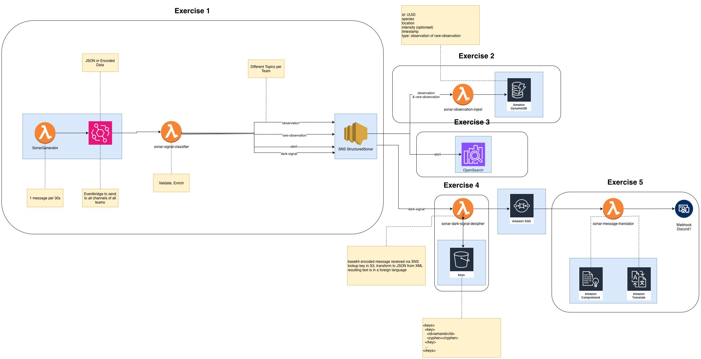

<!-- alignment: center -->

# HTF25 Aquatopia Challenge
## The Serverless Quest Beneath the Surface

**Team:** MaranzasDiBrugge

<!-- end_slide -->

<!-- alignment: center -->

Who are we
---
International "Students" from Howest

Teo
Leo

<!-- end_slide -->

<!-- alignment: center -->

# What We Built

- **5 Lambda Functions (more or less)** processing sonar signals
- **Event-Driven Architecture** with EventBridge, SNS, SQS
- **Multi-Storage System** (DynamoDB + OpenSearch)
- **Real-time Translation** and Discord integration

<!-- end_slide -->

# All Levels Completed 

- Level 1: Signal Classifier
- Level 2-3: Observation Ingest
- Level 4: Dark Signal Decipherer
- Level 5: Message Translator

<!-- end_slide -->

# What Went Well 

<!-- incremental_lists: true -->

- Clean architecture with separated concerns
- Comprehensive error handling
- Successful AWS service integration
- Effective team collaboration

<!-- pause -->

- Quick problem solving
- Clear division of work
- Fast iteration on issues

<!-- end_slide -->

# The Challenges 

<!-- incremental_lists: true -->

## AWS Permissions
- OpenSearch 403 Forbidden errors
- SQS queue permission issues
- IAM role configuration complexity

<!-- pause -->

## Integration Complexity
- SNS nested JSON parsing
- OpenSearch AWS SigV4 authentication
- Cipher decryption implementation

<!-- pause -->

## Time Constraints
- Limited testing time
- Documentation gaps
- Free tier rate limits

<!-- end_slide -->

# Biggest Surprises 

<!-- incremental_lists: true -->

1. **OpenSearch Permissions** - More complex than expected

<!-- pause -->

2. **SNS Message Structure** - Required double JSON parsing

<!-- pause -->

3. **AWS X-Ray** - Helpful but added complexity

<!-- pause -->

4. **Rate Limits** - Had to manage free tier constraints

<!-- end_slide -->

# What Didn't Go Well 

<!-- incremental_lists: true -->

## OpenSearch Integration
- 403 Forbidden errors
- Alerts not being indexed
- Workaround: Graceful error handling

<!-- pause -->

## Initial Deployment
- Configuration errors
- Lost time debugging
- Solution: Better local testing

<!-- pause -->

## Time Management
- Spent too much time on one level
- Rushed final levels

<!-- end_slide -->

# Lessons Learned 

<!-- incremental_lists: true -->

1. **AWS Permissions are Critical**
   - Check IAM roles first when things fail

<!-- pause -->

2. **Event Structure Understanding**
   - Each AWS service formats events differently
   - Always log the raw event first

<!-- pause -->

3. **Time Management**
   - Prioritize working features over perfect code
   - Test integrations early

<!-- pause -->

4. **Documentation**
   - AWS SDK docs are comprehensive
   - But examples are sometimes missing

<!-- end_slide -->

# What We'd Do Differently

<!-- incremental_lists: true -->

- More local testing with SAM
- Earlier integration testing
- Better error messages from the start
- Set up CloudWatch dashboards earlier

<!-- pause -->

- More pair programming on complex parts
- Document decisions as we go
- More systematic testing approach

<!-- end_slide -->

# The Numbers 

<!-- column_layout: [1, 1] -->

<!-- column: 0 -->

- **Lambda Functions**: 5
- **AWS Services**: 8+
- **Time to Complete**: [FILL IN]

<!-- column: 1 -->

- **Levels Completed**: 5/5
- **Deployments**: [FILL IN]
- **Team Members**: [FILL IN]

<!-- reset_layout -->

<!-- end_slide -->

# Team Reflection 

<!-- incremental_lists: true -->

## Strengths
- Clear communication
- Complementary skills
- Quick decision making

<!-- pause -->

## Areas for Improvement
- Better upfront planning
- More thorough code reviews
- Better test coordination

<!-- end_slide -->

# The Final Result 

**All 5 Levels Completed**
**Fully Functional Pipeline**
**Successfully Deployed**

<!-- end_slide -->

# Advice for Future Teams

<!-- incremental_lists: true -->

1. **Start with Permissions** - Set up IAM roles correctly from the start

<!-- pause -->

2. **Log Everything** - CloudWatch is your best friend

<!-- pause -->

3. **Test Locally First** - SAM local is invaluable

<!-- pause -->

4. **Timebox Everything** - Don't spend too long on one problem

<!-- end_slide -->

# Final Thoughts

**Journey of learning and problem-solving**

Built a complete serverless system, integrated multiple AWS services, delivered under time pressure.

**Key Takeaway**: Serverless requires careful attention to permissions, event structures, and error handling.

<!-- end_slide -->

# Questions?

**Team MaranzasDiBrugge**

*HTF25 Aquatopia Challenge*

<!-- end_slide -->
